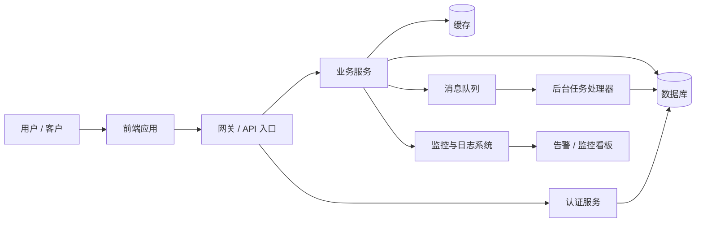

# 系统架构概览

下面这张图用一个简单的“餐厅”比喻来理解：
- 用户相当于顾客
- 前端相当于点单界面
- 网关相当于前台
- 后端服务相当于厨房
- 数据库相当于账本和仓库
- 队列相当于后厨接单区
- 监控相当于厨房指挥和检查

## 各部分的作用

- 用户：最终使用系统的人。
- 前端应用：网站、App 或网页界面，负责展示内容和接收用户操作。
- 网关 / API 入口：所有请求都从这里进来，再分发到不同服务。
- 认证服务：确认用户身份，并决定是否允许访问某些功能。
- 业务服务：处理核心功能逻辑，比如下单、查询、支付、报表等。
- 数据库：保存系统的关键数据，比如用户信息、订单、日志等。
- 缓存：临时保存常用数据，加快读取速度。
- 消息队列：把一些不需要马上处理的任务放到队列中去执行。
- 后台任务处理器：负责处理消息队列里的异步任务。
- 监控与日志系统：记录系统运行状态，帮助排查问题。

## 一句话总结

这个系统的核心思路很简单：
前端负责展示，网关负责接收请求，服务负责处理业务，数据库负责存储，缓存提升速度，消息队列处理异步任务，监控保证系统稳定运行。

## 适合小白理解的版本

可以把它理解成：
- 前端 = 点单台
- 网关 = 前台
- 业务服务 = 厨师
- 数据库 = 仓库
- 缓存 = 常用食材架
- 队列 = 后厨接单区
- 监控 = 经理在看厨房状态

这样一来，整个系统就更加容易理解了。
