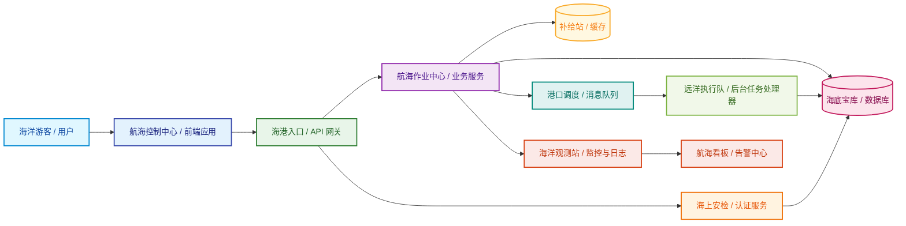

# 海洋风架构概览（冲击版）

这张图把整个系统想象成一艘航行在大海中的智能船队：
- 用户是船上的乘客
- 前端是航海控制中心
- 网关是海港入口
- 认证服务是安全检查站
- 业务服务是船员和各个工作组
- 数据库是海底宝库
- 缓存是海上补给站
- 消息队列是港口调度中心
- 后台任务处理器是远洋执行队
- 监控系统是海洋观测站

## 图解说明

- 用户：系统的使用者，就像船上的乘客。
- 前端应用：用户看到和操作的界面，像航海控制中心。
- 网关：所有请求统一进入港口，再分发到各个服务。
- 认证服务：做安全检查，确认身份和权限。
- 业务服务：处理真实业务逻辑，像船员在各自岗位上协作。
- 数据库：保存核心数据，像海底宝库。
- 缓存：提供快速访问，像海上补给站。
- 消息队列：处理异步任务，像港口调度中心。
- 后台任务处理器：真正执行这些任务，像远洋执行队。
- 监控与日志：负责观察系统是否稳定运行。

## 一句话总结

整套系统就像一艘航行在深海中的智能船队：
前端负责导航，网关负责入港，业务服务负责执行任务，数据库负责保存宝藏，缓存负责补给，消息队列负责调度，监控负责全局巡航。

这就是一个稳定、高效、可扩展的系统架构。
