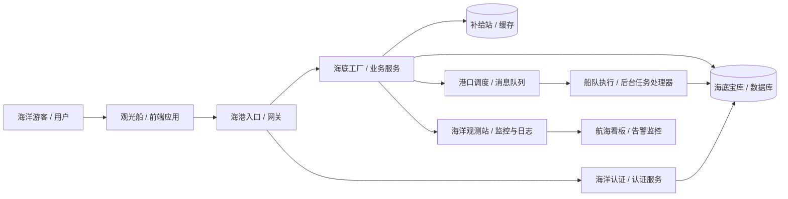

# 海洋风架构概览

这张图把系统想象成一个“海洋中的运作网络”：
- 用户像海洋中的游客
- 前端像水面上的观光船
- 网关像港口入口
- 业务服务像海底的工厂和船队
- 数据库像海底宝库
- 缓存像海上快速补给站
- 消息队列像港口调度中心
- 监控像海洋观测站

## 各部分功能说明

- 用户：真正使用系统的人。
- 前端应用：展示界面和交互入口，像船上的操作台。
- 网关：所有请求先经过这个入口，再分发到各个服务。
- 认证服务：确认用户身份，决定是否允许访问某些功能。
- 业务服务：处理核心逻辑，像海底工厂负责制造和处理任务。
- 数据库：保存重要数据，像海底宝库一样存放系统信息。
- 缓存：临时保存常用数据，提高访问速度，像补给站。
- 消息队列：把异步任务放在港口里排队处理，避免阻塞。
- 后台任务处理器：推进队列中的任务，像船队执行命令。
- 监控与日志：观察整个系统状态，发现问题并及时处理。

## 一句话总结

整个系统就像一座海洋中的运作网络：
前端负责航行，网关负责进港，业务服务负责生产，数据库负责存储，缓存负责补给，队列负责调度，监控负责全局观测。

这就是一个稳定、高效、可扩展的系统架构。
